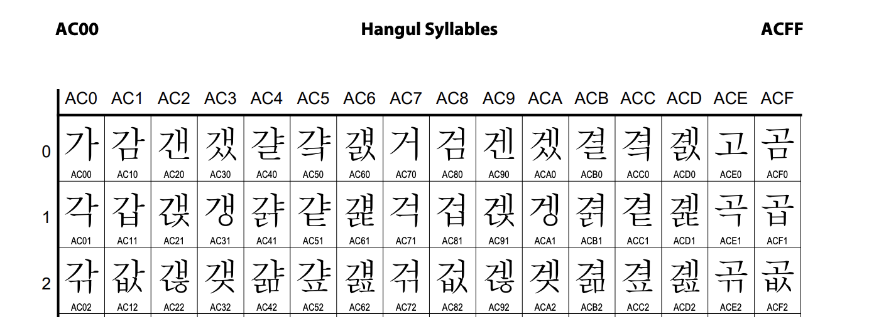
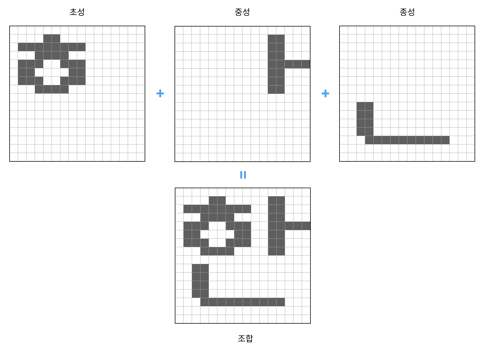
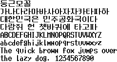
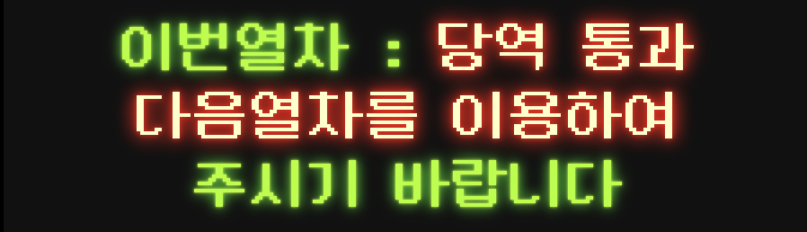
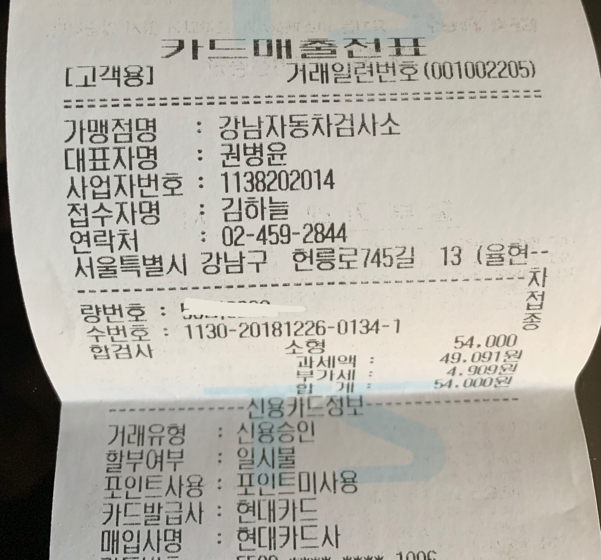
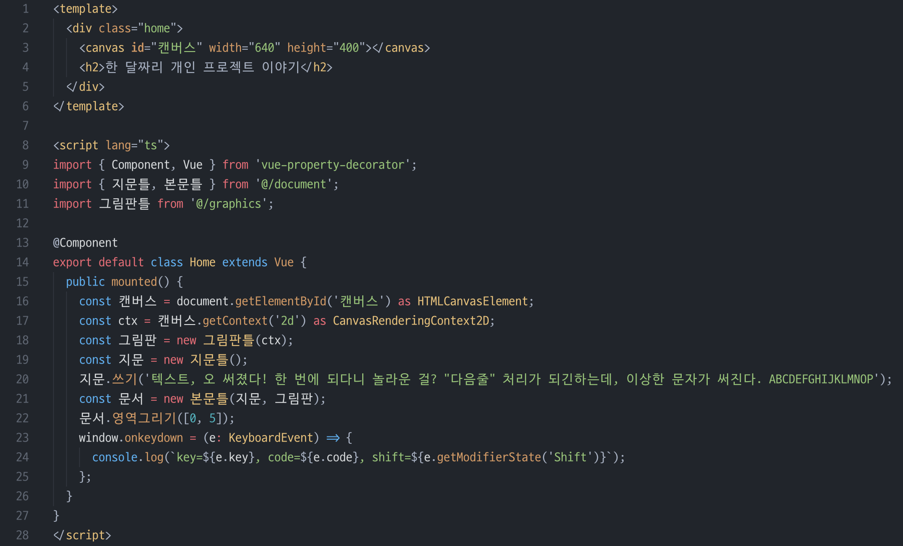

# 한 달짜리 개인 프로젝트 이야기 (2) - 한글 비트맵 글꼴, 둥근모꼴

아무래도 전 참 인간적인가 봅니다. 한 달여 혼자만의 시간 동안 개인 프로젝트를 열심히 하겠노라 공개적으로 큰소리쳐놓고도, 정작 여유 시간이 많아지자마자, 넷플릭스와 모바일 게임에 푹 빠져 지내느라 충혈된 눈이 풀리지가 않습니다. 이대로라면 이번 프로젝트는 폭망입니다. 원래의 계획과 달라 자책감까지 들지만, 한편으로는 '이게 다 인간적인 모습이려니'하고 위안해 봅니다. 자책은 그만두고, 이번 프로젝트의 주요 기능 중 한 부분에 대한 설명을 드리겠습니다.

## 프로그램이 한글을 그리는 방법

컴퓨터가 글자를 모니터 화면이나 종이에 보이려면, 사람이 적는 것과 비슷하게 프로그램이 그립니다. 어떤 글자를 적을지 유니코드라는 숫자로 지정한 코드표가 있고, 글꼴(폰트) 파일에는 그 숫자마다 글자를 어떻게 그리면 되는지 정보가 있지요. 결국 화면이나 종이에 적는 프로그램은 각 글자마다의 위치(레이아웃)를 판단한 다음, 그 위치에 글꼴 정보에 들어있는 그리는 방식에 따라 점이나 선을 그려서 표현하고, 그 그림을 사람이 눈으로 보고 글자로 인식할 수 있습니다.

요새는 글자를 그리는 선을 벡터로 표현한 '벡터 글꼴'이라는 걸 쓰는데, 이는 외곽선 글꼴이라고도 하고, 윤곽선 글꼴이라고도 합니다. 벡터 글꼴은 다양한 크기의 글자를 그릴 때도 문제없이 예쁘게 그릴 수 있습니다. 흔히 쓰는 `.ttf' 파일이 트루타입 폰트라고, 벡터 글꼴의 일종입니다.

예를 들어, "가"라는 한글 한 자는 유니코드로 16진수 AC00이라는 숫자(코드)로 지칭하기로 전 세계가 약속으로 정했고, 이 코드를 만나면 "가"라는 그림(!)을 어떻게 그려야 하는지 정보가 폰트 파일에 담겨 있는 거지요. 복잡한 얘기지만, 어차피 운영체제 수준에서 알아서 잘 그려주기 때문에 사용자나 개발자는 어떤 글꼴을 쓸지만 고르면 되는 식이라, 우리가 자세히 알 필요는 없는 부분이기도 합니다.

그런데, 이번 프로젝트에서 한글의 자소를 각각 다른 색상으로 표현해보고 싶습니다. 한글 한 글자의 초성과 중성과 종성을 각각 다른 색으로 보이고 싶었던 거죠. 과연 이번 프로젝트의 핵심 기능에 얼마나 중요한 부분일지 확실치 않습니다만, 기술적 흥미가 당겨서 깊이 파고들고 있습니다.

한글 트루타입 글꼴은 한글로 쓰는 거의 모든 글자에 대해 (약 11,500자) 한 글자 한 글자 예쁘게 그려놓은 것으로 알고 있습니다. 자소 조합에 따라 전체 글자가 조화롭게 그리기는 좋지만, 최소 단위가 글자 전체이기 때문에, 그 글자 내에서 초성, 중성, 종성을 분리해서 그리는 용도로 쓰기는 어려울 것 같습니다. (혹시 좋은 방법을 알고 계신다면, 댓글 부탁드립니다.)

## 비트맵 폰트

이런 고민을 하던 차에 운 좋게 옛 생각이 떠올랐습니다. 예전 90년대 초중반 MS-DOS 시절에는, 하드웨어 사양과 화면 해상도가 낮았기 때문에 외곽선 폰트보다 비트맵 폰트라는 걸 많이 썼었습니다. 비트맵 폰트는 각 글자를 그리기 위해 점 단위로 찍을지 말지를 비트로 표현하는데요, 마치 정해진 크기의 모눈종이에다가 각 칸을 칠하거나 놔두거나 하는 방식입니다. 영문은 흔히, "가로 8칸 x 세로 16칸"을 썼고, 한글은 가로x세로, 16x16칸을 써서 그렸습니다. 한 칸을 1비트로 쓰니까, (16 x 16 = 256비트 = 32바이트)로 한 글자를 그리는 셈입니다. 이미 고정한 크기에 그려놓은 것이라, 더 크거나 작게 그리면, 글자가 어그러져 보이는 문제가 있습니다. 그렇게 미리 정한 크기에서만 깨끗하게 보이는 한계가 있었지만, 대신 메모리도 적게쓰고, 쉽고 빠르게 그릴 수 있다는 장점이 있어서 한 시절을 잘 지냈던 글꼴이지요.

글꼴 크기가 정해져 있고, 한글이 예뻐 보이기 어려운 정사각형 모양에다가, 요새 화면 해상도에는 너무 부족한 비트맵 글꼴을 왜 눈여겨보느냐면요, 이 비트맵 폰트로 한글을 그리던 방식이 조합형이었다는 점이 떠올랐기 때문입니다. 조합형 글꼴이 무엇이냐면, 초성, 중성, 종성을 각각 따로 그려 놓고, 원하는 글자를 만들기 위해 조립해서 그리는 글꼴을 말합니다. 예를 들어, "한"이라는 글자를 그리기 위해서, 미리 준비해 둔 초성 "ㅎ", 중성 "ㅏ", 종성 "ㄴ"을 차례로 그려서 글자를 완성하는 것이지요.

위 그림처럼, 세장의 그림을 겹쳐서 그리면 하나의 글자가 완성되는 방식입니다. 그러니, 저는 이 비트맵 글꼴을 직접 그리면서, 초성을 그릴 때와, 중성을 그릴 때와, 종성을 그릴 때 각각 다른 색상으로 그리면 되는 거지요.

문제는, 이 작업이 시간과 노력이 꽤 많이 들 거라는데 있습니다. 과연 이번 결과물에 그렇게까지 중요한 요소인지는 아직 잘 모르겠습니다. 막연히 초중종성에 색칠을 따로 해야 좋을 것 같다는 추측인데, 정말 사람들이 유용하게 여길지는 모르는 일이니까요. 게다가, 비트맵 글꼴은 글자가 꽤나 오래된 느낌이 팍팍 납니다. 뭔가 레트로풍이라는 감성을 자극할지는 모르겠으나, 어쨌건 요새 시대에는 맞지 않는 글꼴이지요. 요새는 모니터들도 레티나급을 쓰는 시대인데, 16x16 글꼴로 그리기에는 너무 부족한 거죠.

자소 별 다른 색상으로 그리는 것이 얼마나 주효할지는, 화면에다가 여러 문장을 찍어두고, 스케치 같은 프로그램으로 손으로 칠해보고, 눈으로 확인해봐도 좋을 것 같습니다. 그렇게 확인해보고, 다른 사람에게도 보여주어서 정말 유용할지를 미리 가늠해 보는 거지요. 일반 프로젝트도 프로토타이핑 먼저 해보지 않습니까? 그렇게 미리 간단하게 해 보면 좋을 텐데, 제 비합리적인 마음은 이미 이걸 만들어 보고 싶어졌습니다. 스케치 프로토타이핑을 하기도 전에 이미 전 코딩에 돌입했습니다.

아, 놔.

## 둥근모꼴

이 비트맵 글꼴이 널리 쓰이던 시절에, 특히 "둥근모꼴"이라는 글꼴이 유행했다고 합니다. 요새로 치면 아마도 SIL 오픈소스 라이선스를 따르는 파격적인 글꼴이었던 데다, 꽤 가독성이 좋아서 당시 사람들이 인터넷 쓰듯 많이 썼던 PC통신 프로그램에 기본 내장된 글꼴이기도 했다고 합니다. 그래서 PC통신을 했던 사람들은, "둥근모꼴"이 뭔지는 몰라도, 이 글꼴을 보면 익숙한 글꼴임을 알아채게 됩니다.

출처: 위키백과

이렇게 생긴 글꼴인데요, 심지어, 이 글꼴을 요새의 TTF 글꼴로 변환하여 공개하시는 분들도 있습니다. 배경색도 딱 그 파란색이라 옛 추억을 되새기는 재미가 좋습니다.

PC통신을 안 해보신 분들도 사실 대단히 익숙한 글꼴입니다. 왜냐하면, 지하철 전광판에서 쓰이는 글꼴이기도 하기 때문입니다.

출처: http://cactus.tistory.com/193

이 글꼴을 쓰면 되겠습니다. 그런데, 이 글꼴의 원본 파일을 구할 수가 없었습니다. 정은빈님이 둥근모꼴을 기반으로 만들어 공개한 [네오둥근모꼴](http://dalgona.hontou.moe/neodgm/) 프로젝트에서 둥근모꼴 데이터를 찾을 수 있었는데요, 이걸 기반으로 일단 코딩은 시작했습니다. 원본 파일을 구하실 수 있는 분은 제보 부탁드립니다.

## 다른 비트맵 글꼴

또 비트맵 글꼴은, 우리 일상에서 더 널리 쓰이는 것 같습니다. 아마도 일상생활 중 결제하고 카드전표나 영수증을 받으면 찍혀있는 글자가 비트맵 글꼴이 아닐까 합니다. 아래는 얼마 전 제가 받은 카드전표입니다.

벡터 글꼴로 그린 건데, 출력장치의 해상도가 낮아서 비트맵 글꼴로 보인 걸 수도 있겠습니다만, 16x16보다는 해상도가 좋아 보이고, 아마도 한 24x24크기의 비트맵 글꼴일 것 같기도 합니다. 옛 시절에도 화면에는 주로 16x16 크기를 썼지만, 프린터에 쓰는 글꼴은 더 큰 것을 썼을 겁니다.

아까도 말씀드렸듯이, 과연 이 프로젝트에 얼마나 중요한 부분인지, 또, 요새 기준에는 못생긴 글자를 쓰면서까지 적용할 부분인지는 아직 모르겠습니다. 아예 레트로 콘셉트 디자인으로 입혀보면 좋겠지만, 제가 뭔가 디자인을 할 수 있는 것도 아니고, 마냥 걱정되기만 하네요. 만약, 24x24 크기의 무료 (조합형) 비트맵 글꼴이 있다면, 제보 부탁드립니다. 24x24 정도면, 화면에 보이기에는 그렇게 나쁘지 않을 것 같습니다.

## HTML5 캔버스 (Canvas)

암튼, 일단은 둥근모꼴을 이용해서 화면에 그릴 건데요, 이 전 글에도 공개했듯, 이번 프로젝트는 분명 웹앱입니다. 웹에서 그리려면, HTML5 캔버스를 쓰면 됩니다. HTML 문서에 <canvas></canvas>요소를 준비해 두고, 자바스크립트로 갖가지 그래픽을 그릴 수 있습니다. 캔버스를 이용해 비트맵 글꼴을 그릴 수 있을 것 같습니다. 아래는 현재 개발 중인 코드의 캔버스 초기화 부분입니다.

canvas 요소에 있는 getContext('2d') 메소드를 호출하면, CanvasRenderingContext2D를 구할 수 있고, 해당 컨텍스트를 이용해서 선을 그리거나 영역을 칠하거나 이미지를 그릴 수 있습니다. 글꼴은, 이미지 형태로 변환해서 그리면 되겠습니다.

## 시간은 정해져 있다

이렇게 꼬물꼬물 작업을 하고 있긴 합니다만, 역시나 기대보다는 진도가 늦습니다. 이번 주말을 매진해서 진도를 뽑아야 하겠습니다.

한편, 이렇게 시간이 정해져 있어서, 더 소중하게 써야겠다는 생각이 듭니다. 언제라도 할 수 있다고 생각하면, 결국 당장의 급한 일이나 재밌는 일들에 손이 가고, 그렇게 미루고 미루다 못하게 되는 경우가 더러 있는 것 같습니다.

앗, 그런데 잠깐, 어차피 우리 인생의 시간이 정해져 있는 건 아니던가요? 이번 한 달의 자유시간 뿐만이 아니라요.

긴 글 읽어주셔서 감사합니다. 아래 박수 버튼을 누르면 다음 글이 빨리 올라옵니다. 핫핫.
