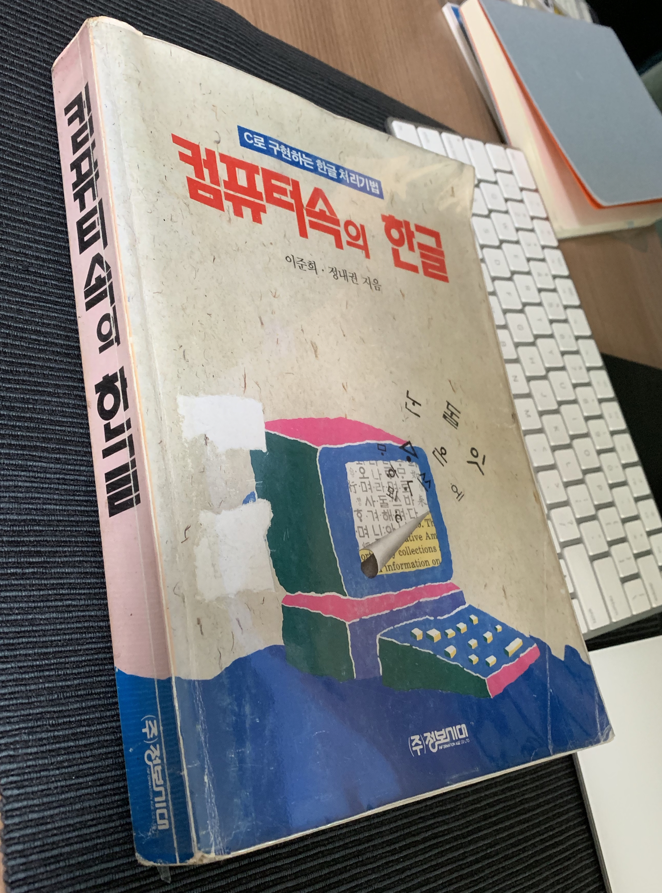
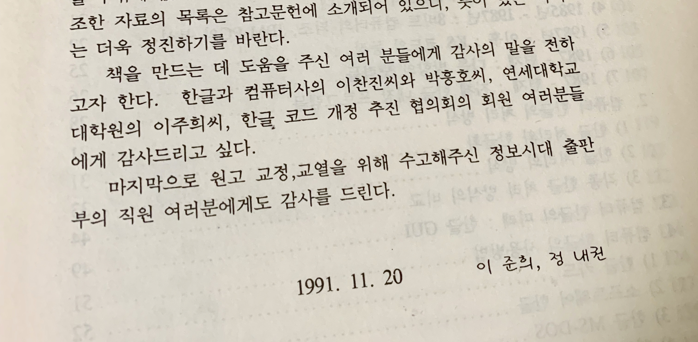
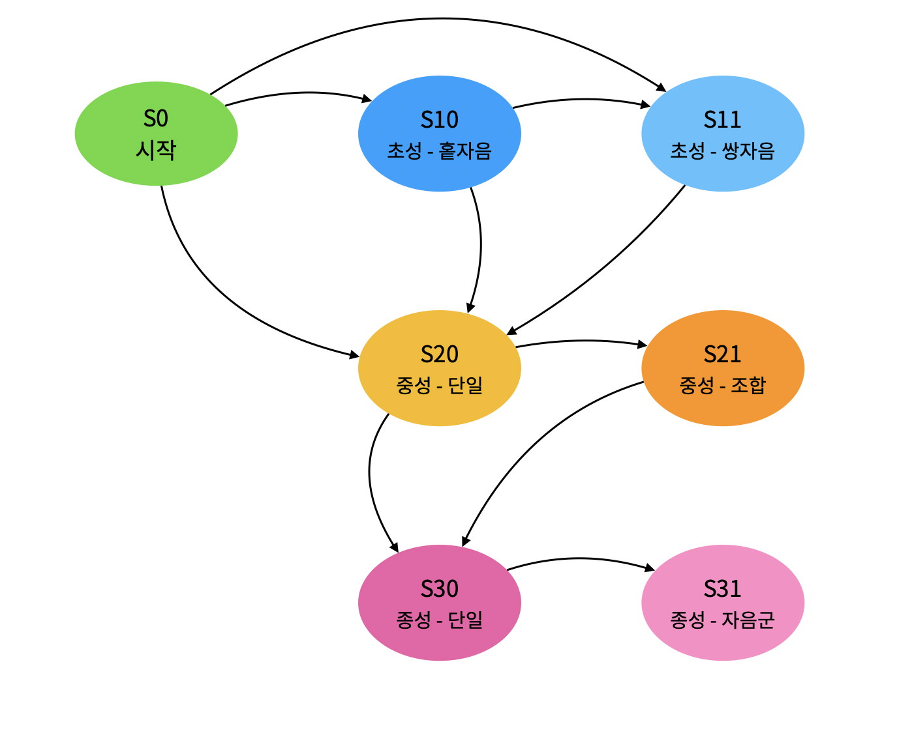
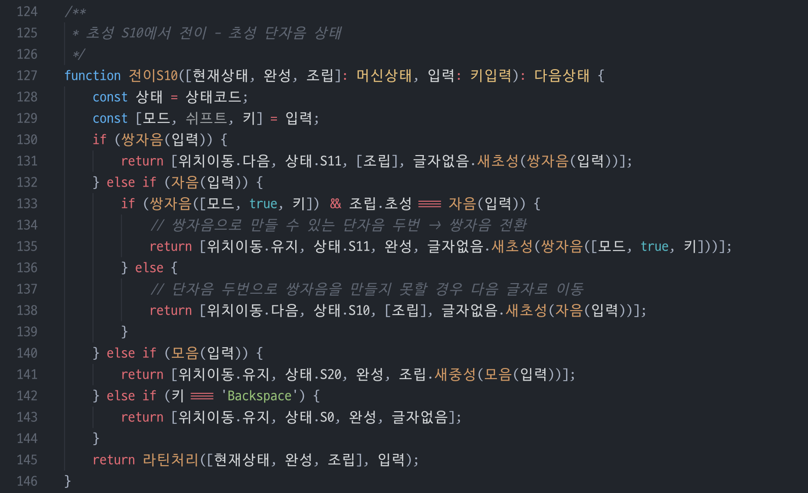
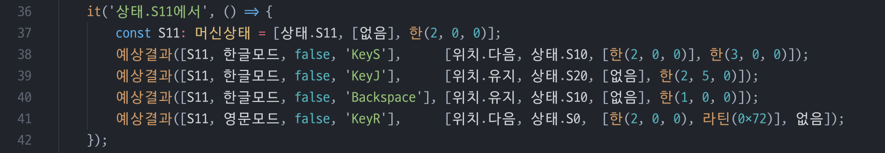

# 한 달짜리 개인 프로젝트 이야기 (3) - 한글 입력 오토마타

요새 회사 헬스장에서 일주일에 세 번 운동하고 있습니다. 워낙 빈약한 몸이라, 운동이래봐야 가벼운 아령 깔짝깔짝 드는 정도인데도, 참 가기가 싫습니다. 이 핑계 저 핑계 떠오르며,  오늘 안가도 되는 이유를 창의적으로 생각해 내고는 하지요. 그러면서도 막상 헬스장에 가서 시작하면, 언제 그랬냐는듯 그럭저럭 운동하고 샤워를 하고 꽤나 상쾌한 마음으로 돌아옵니다.

운동하는 것과 개인 프로젝트 개발과의 공통점이 있습니다. 시작하기가 싫다는 점이지요. 그래도 막상 키보드 앞에 앉아서 시작하면, 그럭저럭 진행이 되지요. 또, 하루이틀 열심히 한다고 되는 게 아니라 꾸준히 매일매일 두 서너 시간씩은 공들여야 한다는 점도 운동과 같습니다.

## 한글 프로그래밍

지난 글에서, 한글 비트맵 글꼴을 그리는 방법에 대해 간단히 설명했습니다. 잠깐 관련해서 옛날 이야기 좀 할게요.

예전, PC 운영체제로 MS-DOS를 쓰던 시절에는, 응용 프로그래머들이 직접 한글을 화면에 그리고, 또 입력을 받기도 해야 했습니다. 뭔가 시스템에 띄워 놓으면, 한글을 그려주는 램상주 프로그램이 있기도 했고, 또 아예 한글 입출력을 담당하는 확장 카드 (하드웨어)가 있기도 했지만, 둘 다 부족한 부분이 있어서, 직접 애플리케이션 수준에서 구현하는 방법을 선호한 것 같습니다. 보통은 누군가 능력자가 잘 만들어 놓은 라이브러리를 가져다가 쓰는 방식이었고, 또 어떤 이들은 직접 만들기도 했습니다. 직접 만들기 위해서든, 아니면 원리가 궁금해서든, 관심도 높은 주제였지요.

그래서였을지, 이런 책도 있었습니다.

제목이"컴퓨터 속의 한글"이고, 부제는 "C로 구현하는 한글 처리기법"인데요, 컴퓨터로 한글을 다루는 배경과 프로그래밍 구현을 주제로 책이 있었던 거죠. 심지어, 조판도 당시의 아래아 한글로 한 건지, 책 본문도 비트맵 폰트로 인쇄한 것 같습니다.

암튼, 꽤 오래 전에 이 고마운 책을 샀는데, 나름 요긴하게 봤던 기억 때문인지 아직도 버려지지 않고 책장 구석에 있었습니다. 그간 책장 정리를 여러 번 했을 텐데 용케 살아남은 책이네요. 비트맵 폰트를 그리느라 이 책을 다시 뒤적여 봤습니다. 색바랜 종이에 열악한 활자에도 정이 갔습니다.

## 한글 입력 오토마타

저 오래 전, 한글 입력 오토마타라는 걸 만들어 보려다 흐지부지 포기했던 기억이 납니다. 당시 워낙 꼬꼬마였고, 오토마타가 뭔지를 이해하기에는 역부족이었나 봅니다. 그 아쉬움을 달래줄 절호의 기회가 왔습니다. 이번 프로젝트에 한글 비트맵 폰트를 그리는 것과 더불어 한글 입력기가 별도로 있으면 좋을 것 같습니다. 어쩌면 시스템에 있는 한글 입력기의 힘을 빌리는 방법이 있을 것도 같습니다만, 역시 전 삼천포로 빠져서 이미 코딩을 시작하고 있습니다. 어릴 때 뭔가 해보고 싶었던 걸 이제라도 다시 하는 건, 꽤 재밌는 일인 것 같습니다. 좀 비생산적이긴 해도, 유치한 일은 아니니 다행입니다.

우리가 요새 쓰는 자판은 한글 두벌식 자판이라고, 자음 한벌과 모음 한벌로 키를 구성해서 입력하는 방식입니다. (세벌식이라고 초성 한 벌, 중성 한 벌, 종성 한 벌을 써서 입력하는 방식도 여러가지 있습니다만, 저는 다루지 않겠습니다. 왜 다루지 않으려는지는 이번 프로젝트가 끝나기 전에 말씀드리기로 할게요.)

두벌식 자판은 왼손 위치에 자음, 오른손 위치에 모음을 배치한 방식으로, [KS X 5002]라는 국가 표준으로 1982년에 제정됐습니다. 표준에 선택적으로 구현하라는 부분이 있는지, 구현마다 동작이 조금 다르긴 해도 큰 차이를 느끼지 못하는 정도입니다. 현재 입력하고 있는 글자의 상태에 따라 여러 조건에 맞춰서 초성, 중성, 종성을 조립하고, 또 때로는 종성을 다음 글자의 초성으로 보내기도 하면서 글자 하나하나를 만들어 내면 됩니다.

아까 언급한 책에 있는 상태도를 따를까 하다가, 재미삼아 그냥 바닥부터 새로 만들어봤습니다.

* S10과 S11은 초성을 구성한 상태, S20과 S21은 중성까지 구성한 상태, S30과 S31은 종성까지 구성한 상태입니다.
* 처음에는 S0 상태에서 시작합니다. S0에서 'ㄱ','ㄴ','ㄷ' 같은 홑자음이 입력되면 S10으로 갑니다. S0에서 ㄲ, ㄸ 같은 쌍자음이 입력되면 S11로 갑니다.
* S0에서 곧바로 'ㅏ' 같은 모음이 입력되면, 보통의 정상적인 글자는 아니지만, S20상태로 갑니다.
* S10에서는, 이건 macOS 기본 한글 입력기에서 쓴 방식인데, 홑자음을 동일한 것을 하나 더 붙여 쌍자음 초성으로 S11로 갑니다. 예를 들어, ㄱ을 입력한 상태에서 ㄱ을 한 번 더 누르면 ㄲ로 만들어 주는 거죠. 윈도우 기본 한글 입력기는 이렇게 조합하지는 않습니다.
* S20은 키 한 번 눌러서 만든 모음으로 중성을 쓴 상태인데, 여기에 키를 한 번 더 눌러서 S21에 중성 조합 상태로 갈 수 있습니다. 예를 들어 'ㅢ'는 두벌식에서 'ㅡ'와 'ㅣ'를 눌러서 조립합니다.
* S20이나 S21은 중성까지 조립한 상태인데, 여기서 다시 자음을 누르면 S30으로 갑니다. 홑자음과 쌍자음 모두 S30으로 가고, ㄳ, ㄵ, ㄶ 처럼 두 자음으로 구성하는 '자음군'은 S31상태로 갑니다.
* S30이나 S31에서 자음이 입력되면, 지금까지 구성한 초성, 중성, 종성으로 한 글자를 완성하고, 다음 글자의 S10이나 S11로 갑니다.
* S30이나 S31에서 모음이 입력되면, 지금까지 구성한 글자의 종성에서 마지막 자음을 떼서 다음글자의 초성으로 보냅니다.

일일이 적자면 훨씬 더 많은 내용이 필요합니다만, 대략 이런 조건으로 상태를 이동해 가며, 각각의 상태에서 다양한 조건 처리를 하면서 한글 한 자 한 자를 조립할 수 있습니다. 실제 코드로 보이면, 아래 코드가 S10에서 새 키 입력을 받아 어떤 상태로 이동할지를 가르는 부분입니다.

각각의 상태별로 함수를 따로 만들어 테스트 코드를 추가했고, 아래가 S10상태에 대한 테스트 코드입니다.

함수 인자와 결과 값의 형태가 다소 복잡합니다만, 타입스크립트가 형식을 딱딱 잡아주니 편하게 개발할 수 있었습니다. 그리고, 코딩 주제가 한글이니만큼, "한글로 코딩"하는 게 빛을 발하고 있습니다. ㅎㅎ

## 다행히 이번엔 만들다

오래된 책의 기운을 받으며, 한글 입력기를 구현하느라 며칠을 보냈습니다. 다행히 만족스러운 입력기를 만들었습니다. 역시 이런 도메인은 한글로 코딩하는 게 참 편하고, 또, 타입스크립트가 엄격하게 타입 검사를 해주는 부분도 유용하다 여겼습니다.

우선은, 개발 진도가 늦어졌으니, 오늘은 "한글 입력기, 타입스크립트로도 잘 만들었다"고 자랑하는 정도로 그칠게요. 언젠가 프로젝트가 잘 진행되고, 한글 입출력에 대해서 상세히 따로 정리할 수 있는 기회가 있기를 바랍니다.

긴 글 읽어주시고, 프로젝트 응원해 주셔서 감사합니다.
