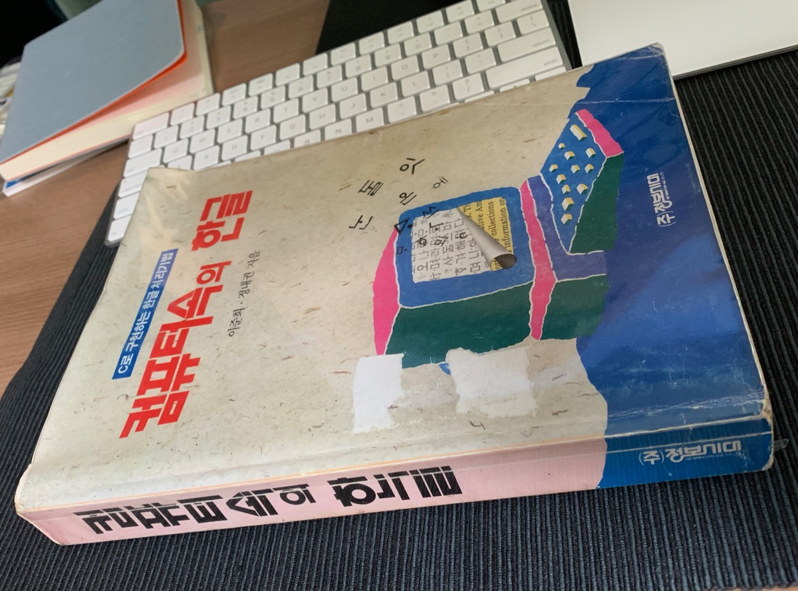

# 한 달짜리 개인 프로젝트 이야기 (3) - 한글 입력 오토마타

요새 회사 헬스장에서 1주일에 세 번 운동하고 있습니다. 워낙 허약한 몸이라, 운동이래봐야 가벼운 아령 설렁설렁 드는 정도이지만, 그래도 참 가기가 싫습니다. 이 핑계 저 핑계 떠오르며, 오늘 안 가야 하는 이유, 또는 오늘 안가도 되는 이유를 창의적으로 생각해 내고는 하지요. 그러면서도 막상 헬스장에 가서 운동을 시작하면, 언제 그랬냐는듯, 그럭저럭 운동을 하고 샤워를 하면 꽤나 상쾌합니다.

운동하는 것과 개인 프로젝트 개발과의 공통점이 있습니다. 시작하기가 싫다는 점이지요. 그래도 막상 키보드 앞에 앉아서 시동을 걸면, 그럭저럭 진행이 되기도 하고, 막혀서 정체되기도 합니다. 운동과 마찬가지로 하루이틀 열심히 한다고 되는 게 아니라, 꾸준히 매일매일 두 서너 시간씩은 공들여야 하는 것 같습니다.

## 한글 프로그래밍

지난 글에서, 한글 비트맵 글꼴을 그리는 방법에 대해 간단히 설명했습니다. 잠깐 관련해서 옛날 이야기 좀 말씀드릴게요.

예전, PC 운영체제로 MS-DOS를 쓰던 시절에는, 응용 프로그래머들이 직접 한글을 화면에 그리고, 또 입력을 받기도 해야 했습니다. 뭔가 시스템에 띄워 놓으면, 한글을 그려주는 램상주 프로그램이 있기도 했고, 또 아예 한글 입출력을 담당하는 확장 카드 (하드웨어)가 있기도 했지만, 둘 다 부족한 부분이 있어서, 직접 애플리케이션 수준에서 구현하는 방법을 선호한 것 같습니다. 보통은 누군가 능력자가 잘 만들어 놓은 라이브러리를 가져다가 쓰는 방식이었고, 또 어떤 이들은 직접 만들기도 했습니다. 직접 만들기 위해서든, 아니면 원리가 궁금해서든, 관심도 높은 주제였지요.

그래서였을지, 이런 책도 있었습니다.

제목이"컴퓨터 속의 한글"이고, 부제는 "C로 구현하는 한글 처리기법"인데요, 컴퓨터로 한글을 다루는 배경과 프로그래밍 구현을 주제로 책이 있었던 거죠. 심지어, 조판도 당시의 아래아 한글로 한 건지, 책 본문도 비트맵 폰트로 찍혀있습니다.

